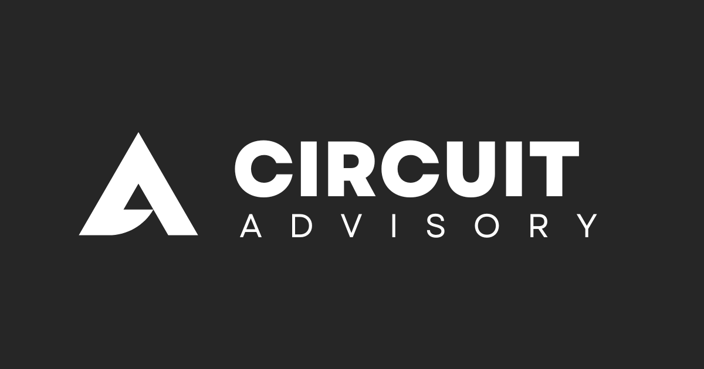

# 🧩 Circuit Advisory

### *Slimme oplossingen voor technische uitdagingen*

---

## 📖 Over ons

**Circuit Advisory** is een consultancy bureau gespecialiseerd in de technische sector. Wij helpen bedrijven en overheden met complexe uitdagingen door praktische, onafhankelijke adviezen te leveren.

Van **procesoptimalisatie** en **duurzaamheidsprojecten** tot **strategische innovatie** – wij vertalen technische vraagstukken naar heldere keuzes en concrete resultaten.

> *"Technisch advies met impact."*

---

## 🎯 Wat wij doen

<table>
<tr>
<td width="33%" valign="top">

### ⚙️ Procesoptimalisatie
Bedrijfsprocessen stroomlijnen en efficiënter maken met data-gedreven inzichten.

</td>
<td width="33%" valign="top">

### 🌱 Duurzaamheidsadvies
Waardeproposities voor hergebruik, circulaire economie en klimaatdoelen voor gemeentes en industrie.

</td>
<td width="33%" valign="top">

### 💡 Strategische innovatie
Technische haalbaarheid en implementatie van nieuwe systemen en werkwijzen.

</td>
</tr>
</table>

---

## 👥 Ons team

### Julius Pleunes
**Research & Innovation Advisor**

Julius brengt een sterke analytische blik en technische diepgang naar complexe optimalisatievraagstukken. Met ervaring binnen de consultancywereld vertaalt hij data, onderzoek en technologische ontwikkelingen naar concrete strategische keuzes.

📧 [julius@circuitadvisory.com](mailto:julius@circuitadvisory.com)

---

### Hyero Balkaran
**Business Development & Partnerships Advisor**

Hyero combineert technische kennis met een scherp gevoel voor kansen binnen duurzaamheid en innovatie. Hij richt zich op het opbouwen van strategische samenwerkingen, het signaleren van nieuwe projecten en het verbinden van organisaties aan toekomstgerichte oplossingen.

📧 [hyero@circuitadvisory.com](mailto:hyero@circuitadvisory.com)

---

## 🛠️ Onze werkwijze

### 🔍 Vier kernprincipes:

1. **DUIDELIJKHEID** – Technische complexiteit vertalen naar heldere adviezen
2. **ONAFHANKELIJKHEID** – Objectieve analyses zonder externe druk
3. **RESULTAATGERICHT** – Focus op meetbare impact
4. **PARTNERSHIP** – Nauwe samenwerking met de klant

---

## 📞 Contact

**Klaar om samen te werken?**

Neem contact met ons op voor een vrijblijvend gesprek.

📧 **Algemeen:** [info@circuitadvisory.com](mailto:info@circuitadvisory.com)  
🔗 **LinkedIn:** [@circuitadvisory](https://www.linkedin.com/company/circuitadvisory)  
🌐 **Website:** [www.circuitadvisory.com](https://www.circuitadvisory.com)  
🌀 **Klantenportaal:** [books.circuitadvisory.com](https://books.circuitadvisory.com)

---

## 🌟 Waarom Circuit Advisory?

<table>
<tr>
<td align="center" width="25%">

 <b>Praktisch</b>
 Van advies naar actie
</td>
<td align="center" width="25%">

 <b>Technisch</b>
 Diepgaande expertise
</td>
<td align="center" width="25%">

 <b>Partnership</b>
 Wij staan naast je
</td>
<td align="center" width="25%">

 <b>Impact</b>
 Meetbare resultaten
</td>
</tr>
</table>

---

## 📄 Juridisch

- 🔒 [Privacyverklaring](https://www.circuitadvisory.com/privacy)
- 📋 [Algemene Voorwaarden](https://www.circuitadvisory.com/terms)
- ℹ️ [FAQ](https://www.circuitadvisory.com/faq)

---

### 🚀 Ready to innovate?

**Laten we in gesprek gaan.**

---

*© 2026 Circuit Advisory. Alle rechten voorbehouden.*

Made with 💜 by Circuit Advisory

